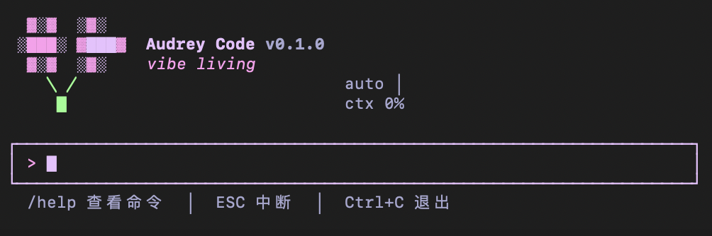
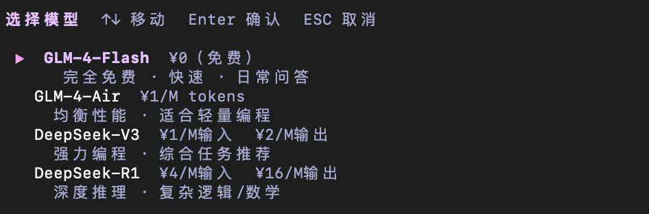

# Audrey Code



实惠轻量 AI CLI 编程助手

---

## v0.1.0 功能

- 流式输出，逐字显示，不等待完整响应
- 工具调用循环：读文件、写文件、执行 shell、glob 搜索，自动多轮直到任务完成
- 智能模型路由，根据 prompt 类型自动选择合适的模型
- `/model` 交互式模型选择器，列出名称、用途和实时价格
- 回答内容支持 Markdown 渲染，包括标题、列表、引用块、分割线
- 代码块语法高亮，覆盖 JS/TS/Python/Bash
- 键盘 ↑↓ 浏览历史指令，最多保留 50 条
- 三层记忆系统：全局 `~/.audrey/AUDREY.md` → 父目录 → 项目目录，启动时自动合并加载
- `/btw` 一次性上下文备注，下次发送时自动携带，用完即弃
- `/compact` 手动压缩上下文，超长对话不断线
- `/resume` 恢复上一次崩溃或退出的会话
- `/save-memory` 把对话摘要写入项目记忆文件
- `/rewind [n]` 回退最近 n 轮对话
- `/undo` 撤销上次文件改动，自动恢复快照
- `/diff` 查看本次会话修改过的所有文件
- `/cost` 查看今日和累计 token 消耗，带每日预算上限
- `/doctor` 健康检查，测试各 provider 连通性和磁盘空间
- `/status` 当前会话概览：模型、权限模式、上下文占用
- `/init` 在当前目录生成 `AUDREY.md` 模板
- Splash 页像素花，进入 REPL 后持续显示在顶部
- 三种权限模式：`ask` 询问确认 / `auto` 全自动 / `deny` 只读
- prompt injection 检测，异常内容不进入上下文
- 会话自动保存为 JSON，支持跨进程恢复

---

## 技术栈

- **Node.js 20** — 运行时，原生支持 ESM 和 `crypto.randomUUID`
- **TypeScript strict** — 全量类型检查，`.js` 扩展名 ESM 导入
- **Ink 5 + React 18** — 在终端里用 React 组件树渲染 TUI 界面
- **GLM-4-Flash / GLM-4-Air** — 智谱 AI，Flash 完全免费，Air 均衡性能
- **DeepSeek-V3** — 强力编程模型，综合任务首选
- **DeepSeek-R1** — 深度推理模型，用于复杂逻辑和数学问题
- **OpenAI 兼容接口 + SSE** — 所有模型统一通过流式接口调用，逐 token 输出
- **Vitest** — 单元测试，覆盖路由、工具、session、provider 各层



---

## 快速开始

```bash
git clone <repo>
cd siyu_code
npm install
cp .env.example .env   # 填入 API Key
npm run build
npm link
audrey
```

进入后运行 `/init` 生成项目记忆文件，`/help` 查看所有命令。

---

## 环境变量

```
GLM_API_KEY=        # 智谱 AI
DEEPSEEK_API_KEY=   # DeepSeek
```
